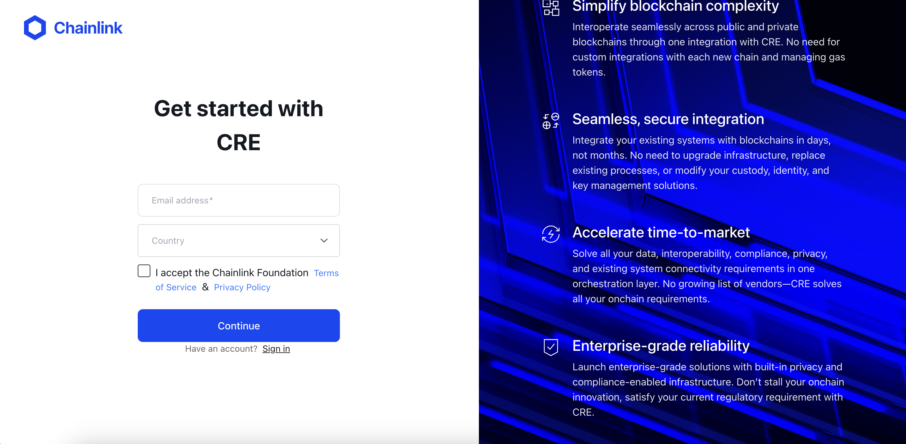
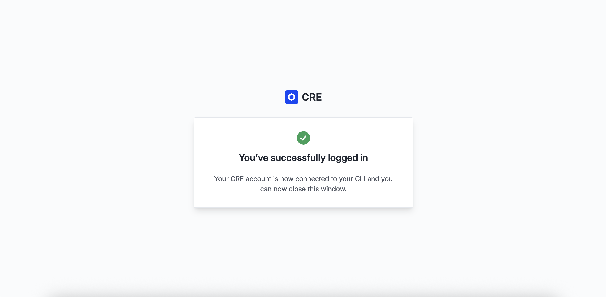

# Chapter 1: Setup Sprint

Before we start building, let's make sure your CRE environment is set up correctly. We'll follow the official setup instructions from [cre.chain.link](https://cre.chain.link).

## Step 1: Create a CRE Account

1. Go to [cre.chain.link](https://cre.chain.link)
2. Create an account or sign in
3. Access the CRE platform dashboard



## Step 2: Install the CRE CLI

The **CRE CLI** is essential for compiling and simulating workflows. It compiles your TypeScript/Go code into WebAssembly (WASM) binaries and allows you to test workflows locally before deployment.

### Option 1) Automatic installation

The easiest way to install the CRE CLI is using the installation script:

#### macOs/Linux

```
curl -sSL https://cre.chain.link/install.sh | sh
```

#### Windows

```
irm https://cre.chain.link/install.ps1 | iex
```

### Option 2) Manual Installation

If you prefer to install manually or the automatic installation doesn't work for your environment, follow the installation instructions from the Official Chainlink Documentation for your platform:

- [macOS/Linux](https://docs.chain.link/cre/getting-started/cli-installation/macos-linux#manual-installation)
- [Windows](https://docs.chain.link/cre/getting-started/cli-installation/windows#manual-installation)

### Verify installation:

```bash
cre --version
```

## Step 3: Authenticate with CRE CLI

Authenticate your CLI with your CRE account:

```bash
cre login
```

This will open a browser window for you to authenticate. Once authenticated, your CLI is ready to use.



Check your login status and account details with:
```bash
cre whoami
```

## What's Now Possible?

Now that your CRE environment is set up, you can:

- **Create new CRE projects/workflows**: Start by running the `cre init` command

- **Compile workflows**: The CRE CLI compiles your TypeScript/Go code into WASM binaries

- **Simulate workflows**: Test your workflows locally with `cre workflow simulate`

- **Deploy workflows**: Once ready, deploy to production (Early Access)

