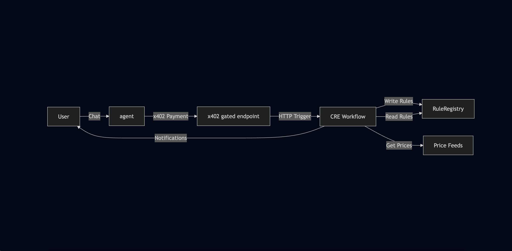

# Chapter 2: The Mental Model

Before we dive into building, let's establish the mental model for the two core technologies we'll be using: **CRE** and **x402**.

## What is CRE?

**Chainlink Runtime Environment (CRE)** is the all-in-one orchestration layer that unlocks institutional-grade smart contracts — data-connected, compliance-ready, privacy-preserving, and interoperable across blockchains and existing systems.

### Key Concepts

**Workflows** are the building blocks of CRE. As developers, we write **Workflows** using the CRE SDK (available in Go and TypeScript). We use the **CRE CLI** to compile these workflows into WebAssembly (WASM) binaries and simulate them locally before deployment. There are some major benefits to thios workflow-based design

- A single workflow can be used with multiple chains, which saves a ton of dev time and infrastructure effort

- Each workflow is orchestrated by a **Workflow DON** that monitors for triggers and coordinates execution

- The workflow can invoke specialized **Capability DONs**—for example, one that fetches offchain data or one that writes to a chain

- During execution, each node in a DON performs the requested task independently

- Their results are then cryptographically verified and aggregated via a **Byzantine Fault Tolerant (BFT) consensus protocol**, guaranteeing a single, correct, and consistent outcome

**Capabilities** are modular, decentralized services that performs a specific task, and each Capability is powered by its own independent Decentralized Oracle Network (DON), which is optimized for that specific task, ensuring security and reliable performance. Currently CRE has the following Capabilities:

- Triggers: Event sources that start your workflow executions.
- HTTP: Fetch and post data from external APIs with decentralized consensus.
- EVM Read & Write: Interact with smart contracts on EVM-compatible blockchains with decentralized consensus.

You can read more about all of these [here](https://docs.chain.link/cre/capabilities).

### What You Can Do with CRE

CRE workflows can do much more than what we'll cover in this workshop. Here's a comprehensive overview:

**Blockchain Interactions:**

- **Read from blockchains**: Query contract state, read events, fetch price data, check balances
- **Write to blockchains**: Execute transactions, update contract state, emit events, deploy contracts
- **Multi-chain operations**: Read from one chain, write to another—all in a single workflow
- **Event-driven workflows**: React to onchain events in real-time

**External Data & APIs:**

- **Call APIs**: Fetch data from any HTTP endpoint, authenticated APIs, webhooks
- **Consensus aggregation**: Multiple nodes fetch the same data, results are aggregated via BFT consensus
- **Data transformation**: Process and transform data before writing onchain
- **Multi-source aggregation**: Combine data from multiple APIs with consensus

**Automation & Scheduling:**

- **Cron schedules**: Run workflows on time-based schedules (every minute, hour, day, etc.)
- **Event triggers**: React to onchain events, HTTP requests, or custom triggers
- **Conditional logic**: Build complex workflows with conditional execution paths

**Advanced Capabilities:**

- **Secret management**: Securely store and access API keys, credentials
- **Error handling**: Robust error handling and retry logic
- **Logging & monitoring**: Built-in logging and observability

### The Trigger-and-Callback Model

Workflows use a simple **trigger-and-callback model**:

1. [**A Trigger**](https://docs.chain.link/cre/capabilities/triggers): An event source that starts a workflow execution (e.g., `cron.Trigger`, `http.Trigger`, `evm.LogTrigger`)
2. **A Callback**: A function that contains your business logic
3. **The `cre.handler()`**: The glue that connects a trigger to a callback

```typescript
cre.handler(
  cronTrigger.trigger({ schedule: "0 */10 * * * *" }), // trigger fires every 10 minutes
  onCronTrigger // your callback function
);

function onCronTrigger(runtime: Runtime<Config>): Record<string, never> {
  // Your business logic here
  return {};
}
```

### Built-in Consensus

One of CRE's most powerful features is that **every Capability execution automatically includes consensus**. When your workflow invokes a Capability (like fetching data from an API or reading from a blockchain), multiple independent nodes perform the operation. Their results are validated and aggregated through BFT consensus, ensuring a single, verified outcome.

This means your entire workflow—not just the onchain parts—benefits from the same security and reliability guarantees as blockchain transactions.

### Compiling and Simulating Workflows

The **CRE CLI** is your primary tool for developing workflows:

- **Compile**: Converts your TypeScript/Go code into WASM binaries
- **Simulate**: Runs workflows locally with real API calls and blockchain interactions
- **Deploy**: Deploys workflows to production DONs (Early Access)

```bash
# Compile and simulate a workflow
cre workflow simulate alerts

# The simulator will:
# 1. Compile your workflow to WASM
# 2. Prompt you to select a trigger
# 3. Execute the workflow locally
# 4. Make real calls to APIs and blockchains
```

## What is x402?

**x402** (Coinbase's standard for machine-to-machine payments) is a micropayment protocol that enables pay-per-call API access. Instead of subscriptions or API keys, users pay small amounts (like 0.01 USDC) for each API request.

x402 activates the old [HTTP 402 ‘Payment Required’](https://developer.mozilla.org/en-US/docs/Web/HTTP/Reference/Status/402) status code, which has been marked as ‘reserved for future use’ since the early web. It never really took off because the web had no native, programmable money layer.

But now, with blockchains and stablecoins, the technology has finally caught up.

### How x402 Works

x402 uses the HTTP 402 status code (Payment Required) to gate API access. Below is the detailed flow and we encourage you to read [the docs](https://docs.cdp.coinbase.com/x402/core-concepts/how-it-works) as well:

```
┌─────────┐         ┌──────────┐         ┌─────────────┐         ┌──────────────┐
│ Client  │────────>│  Server  │────────>│ Facilitator │────────>│  Blockchain  │
└─────────┘         └──────────┘         └─────────────┘         └──────────────┘
     │                     │                      │                       │
     │ 1. GET /alerts      │                      │                       │
     ├────────────────────>│                      │                       │
     │                     │                      │                       │
     │ 2. 402 Payment      │                      │                       │
     │    Required         │                      │                       │
     │<────────────────────┤                      │                       │
     │                     │                      │                       │
     │ 3. Create Payment   │                      │                       │
     │    Authorization    │                      │                       │
     │    (EIP-712)        │                      │                       │
     │                     │                      │                       │
     │ 4. Request +        │                      │                       │
     │    X-PAYMENT        │                      │                       │
     ├────────────────────>│                      │                       │
     │                     │                      │                       │
     │                     │ 5. /verify           │                       │
     │                     ├─────────────────────>│                       │
     │                     │                      │                       │
     │                     │                      │ 6. Settle on-chain    │
     |                     |                      |  (submit tx w/ sig    |
     |                     |                      |  to USDC contract)    |
     │                     │                      ├──────────────────────>│
     │                     │                      │                       │
     │                     │ 7. Settlement        │                       │
     │                     │    Confirmation      │                       │
     │                     │<─────────────────────┤                       │
     │                     │                      │                       │
     │ 8. 200 OK +         │                      │                       │
     │    X-PAYMENT-       │                      │                       │
     │    RESPONSE         │                      │                       │
     │<────────────────────┤                      │                       │
     │                     │                      │                       │
```

### x402 Code Example

Here's how x402 works in code:

**Server Side (Express.js):**

```typescript
import { paymentMiddleware } from "x402-express";
import { exact } from "x402/schemes";

// Protect endpoint with x402 payment
app.post(
  "/alerts",
  paymentMiddleware({
    scheme: exact({
      amount: "0.01",
      currency: "USDC",
      receiver: process.env.X402_RECEIVER_ADDRESS,
    }),
    facilitatorUrl: "https://x402.org/facilitator",
  }),
  (req, res) => {
    // Payment validated, process request
    res.json({ success: true, alertId: "..." });
  }
);
```

**Client Side:**

```typescript
import { x402Fetch } from "x402-fetch";

// x402-fetch automatically handles payment flow
const response = await x402Fetch("http://localhost:3000/alerts", {
  method: "POST",
  body: JSON.stringify({ asset: "BTC", condition: "gt", targetPrice: 60000 }),
  headers: { "Content-Type": "application/json" },
  wallet: {
    privateKey: process.env.PRIVATE_KEY,
    facilitatorUrl: "https://x402.org/facilitator",
  },
});

const data = await response.json();
```

### Key Benefits

- **No API keys**: Payment IS the authorization to use the `/alerts` endpoint
- **Pay-per-use**: No subscriptions, only pay for what you use
- **Cryptographic proof**: Payment is verified on-chain via EIP-712 signatures
- **Instant settlement**: Payments settle immediately on the blockchain
- **Transparent pricing**: Users see exactly what they're paying for

## How They Work Together: Building a Price Alert System

Now let's see how CRE and x402 work together to build our complete price alert system. This is the most important part: understanding the end-to-end flow.

### System Architecture

```
┌─────────────┐
│    User     │
│  (via CLI)  │
└──────┬──────┘
       │
       │ 1. "Alert me when BTC > $60,000"
       │
       ▼
┌─────────────────────────────────────┐
│         LLM Server                  │
│  (Gemini AI + x402 Middleware)      │
│                                     │
│  • Parses natural language          │
│  • Extracts: asset, condition, price│
│  • x402 payment gate ($0.01 USDC)   │
└──────┬──────────────────────────────┘
       │
       │ 2. HTTP POST with alert data
       │    (after x402 payment)
       │
       ▼
┌─────────────────────────────────────┐
│      CRE Workflow                   │
│  (HTTP Trigger Handler)             │
│                                     │
│  • Receives alert data              │
│  • Encodes as ABI parameters        │
│  • Generates CRE report             │
│  • Writes to RuleRegistry contract  │
└──────┬──────────────────────────────┘
       │
       │ 3. On-chain transaction
       │
       ▼
┌─────────────────────────────────────┐
│   RuleRegistry Contract             │
│   (Base Sepolia)                    │
│                                     │
│  • Stores alert rules               │
│  • Rules: {id, asset, condition,    │
│            targetPrice, createdAt}  │
└─────────────────────────────────────┘
       ▲
       │
       │ 4. Cron trigger (hourly)
       │
┌──────┴──────────────────────────────┐
│      CRE Workflow                   │
│  (Cron Trigger Handler)             │
│                                     │
│  • Reads prices from Chainlink feeds│
│  • Reads all rules from contract    │
│  • Evaluates conditions             │
│  • Sends Pushover notifications     │
└──────┬──────────────────────────────┘
       │
       │ 5. Push notification
       │
       ▼
┌─────────────┐
│    User     │
│  (Mobile)   │
└─────────────┘
```

### The Complete Flow

Let's walk through the complete flow step by step:

#### Phase 1: Alert Creation (x402 + CRE HTTP Trigger)

1. **User sends natural language request**

   ```
   "Alert me when BTC is greater than 60000"
   ```

2. **LLM server parses intent**

   - Uses Gemini AI to extract structured data:
     ```json
     {
       "asset": "BTC",
       "condition": "gt",
       "targetPriceUsd": 60000
     }
     ```

- uses AI tool calling to invoke tool (function) to call the `create_price_alert` tool. This tool invokes `createPriceAlert()` which then contacts the x402 Facilitator using x402's helper functions.

3. **x402 payment gate**

   - Server responds with `402 Payment Required`
   - Client (LLM server) creates EIP-712 payment authorization
   - Client (LLM server) retries with `X-PAYMENT` header
   - Client (LLM server) validates payment via Facilitator's `/verify` endpoint
   - Payment settles on-chain ($0.01 USDC)

4. **CRE HTTP trigger receives data**

   - Client (LLM server) sends HTTP POST to CRE workflow
   - Workflow receives alert data in callback

5. **Workflow writes to blockchain**
   - Encodes alert data as ABI parameters
   - Generates CRE report (cryptographically signed)
   - Writes report to RuleRegistry contract
   - Transaction confirmed on Base Sepolia

#### Phase 2: Price Monitoring (CRE Cron Trigger)

6. **Cron trigger fires** (every hour)

   - CRE workflow's cron handler executes

7. **Fetch current prices**

   - Reads from Chainlink Price Feeds:
     - BTC/USD feed
     - ETH/USD feed
     - LINK/USD feed
   - Prices are consensus-verified (multiple nodes)

8. **Read all rules from contract**

   - Calls `getAllRules()` on RuleRegistry
   - Gets all active alert rules

9. **Evaluate conditions**

   - For each rule:
     - Get current price for the asset
     - Check if condition is met (gt, lt, gte, lte)
     - Skip rules older than TTL (30 minutes)

10. **Send notifications**
    - If condition met: Send Pushover notification
    - User receives push notification on mobile device

### What We'll Build

In this workshop, we'll build:

1. **CRE Workflow** with two triggers:

   - HTTP trigger for receiving alert data
   - Cron trigger for monitoring prices

2. **Integration points**:

   - x402-protected server endpoint (`/alerts`)
   - RuleRegistry smart contract
   - Chainlink Price Feeds
   - Pushover notifications

3. **Complete flow**:
   - User creates alert → Payment → On-chain storage → Automated monitoring → Notification


