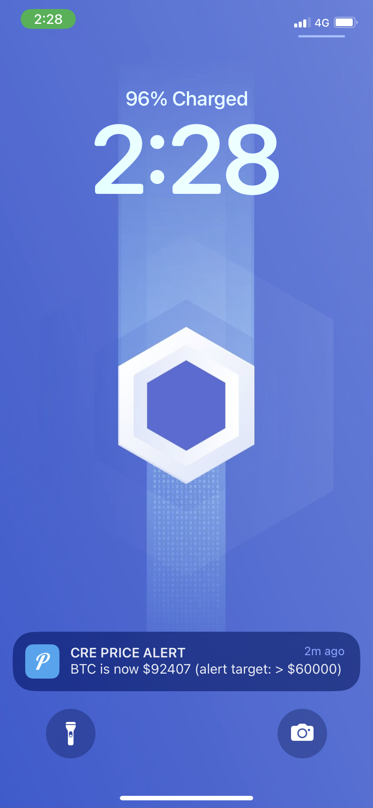

# Chapter 4: Hands-On Exercise

Now that you understand the building blocks from Chapter 3, let's build our complete price alert workflow. This workflow combines all the capabilities we learned:

1. **HTTP Trigger** - Receives alert data from the server
2. **EVM Write** - Writes alerts to the RuleRegistry contract
3. **Cron Trigger** - Monitors prices on a schedule
4. **EVM Read** - Reads prices from Chainlink feeds and rules from the contract
5. **HTTP Client** - Sends notifications when conditions are met

## Our Workflow Structure

The complete workflow consists of:

- **`main.ts`** - Initializes both HTTP and Cron triggers (see [Chapter 3](chapter-3-building-blocks.md) for the pattern)
- **`httpCallback.ts`** - Handles HTTP trigger, decodes alert data, and writes to RuleRegistry using the two-step write pattern
- **`cronCallback.ts`** - Handles cron trigger, reads prices and rules, evaluates conditions, and sends notifications
- **`types.ts`** - TypeScript type definitions for Config, Rule, PriceData, etc.
- **`config.staging.json`** - Workflow configuration

All the code patterns you need are covered in Chapter 3. Here, we'll focus on setting up and running the complete system.


## Complete Demo Sequence

### Step 0: Deploy RuleRegistry Contract

Deploy `contracts/RuleRegistry.sol` to Base Sepolia. Set USDC token address in constructor (Base Sepolia USDC: `0x036CbD53842c5426634e7929541eC2318f3dCF7e`).

You can use this [Remix IDE](https://remix.ethereum.org/?#activate=solidity,fileManager&gist=d09b0dabb744eafb373efea72bdc12b2&call=fileManager//open//gist-0fe90e825327ef313c88aedfe66ec142/gridMix4.sol) link for this. 

>💡 Note the deployed contract address, we will use this later.

_If you do not have testnet tokens or can't deploy the contract for other reasons, you may use this one `0x9B9fC1EeF6BFC76CD07501Ae81b66f24fAB322B1`. However, keep in mind that this demo contract may be populated with multiple alerts from other developers._

### Step 1: Clone and Install

```bash
git clone https://github.com/smartcontractkit/x402-cre-price-alerts.git
cd x402-cre-price-alerts
npm install
```

This will install dependencies for both the `server` and `cre/alerts` workspaces. The `cre/alerts` post install script will automatically run `bunx cre-setup`.

### Step 2: Configure Environment Variables

Create a `.env` file in the **project root** (workspace root):

```bash
cp .env.example .env
```

> ⚠️ The workspace setup uses a single `.env` file at the project root. Both `server` and `cre` workspaces can access environment variables from this root `.env` file. You may specify the `.env` file when using the CRE CLI by passing the `--env` argument.

Edit `.env` with your values:

```bash
# Server Configuration
PORT=3000
X402_RECEIVER_ADDRESS=0x...  # Your wallet or RuleRegistry address
X402_FACILITATOR_URL=https://x402.org/facilitator
GEMINI_API_KEY=your_gemini_api_key
AGENT_WALLET_PRIVATE_KEY=your_private_key  # Must have USDC on Base Sepolia

# CRE Configuration
CRE_ETH_PRIVATE_KEY=your_eth_private_key
CRE_TARGET=staging-settings
PUSHOVER_USER_KEY_VAR=your_pushover_user_key
PUSHOVER_API_KEY_VAR=your_pushover_api_key
```

**Environment Variables Explained:**

- `PORT`: Server port (default: 3000)
- `X402_RECEIVER_ADDRESS`: Address that receives x402 payments (Can be an EOA or Deployed RuleRegistry contract `/contracts`)
- `X402_FACILITATOR_URL`: x402 facilitator endpoint (default: https://x402.org/facilitator)
- `GEMINI_API_KEY`: Your Gemini API key for natural language processing
- `AGENT_WALLET_PRIVATE_KEY`: Private key of wallet used to make x402 payments (must have USDC on Base Sepolia). You can use the same key as your CRE PK.
- `CRE_ETH_PRIVATE_KEY`: ETH private key used for local simulation of EVM Write capability
- `CRE_TARGET`: Target profile for CLI commands
- `PUSHOVER_USER_KEY_VAR`: Your Pushover user key
- `PUSHOVER_API_KEY_VAR`: Your Pushover API key

### Step 3: Configure CRE Workflow

Edit `cre/alerts/config.staging.json` for staging/testing:

```json
{
  "schedule": "0 0 * * * *",
  "ruleTTL": 1800,
  "publicKey": "",
  "evms": [
    {
      "ruleRegistryAddress": "your_deployed_rule_registry",
      "chainSelectorName": "ethereum-testnet-sepolia-base-1",
      "gasLimit": "1000000",
      "dataFeeds": {
        "BTC": "0x0FB99723Aee6f420beAD13e6bBB79b7E6F034298",
        "ETH": "0x4aDC67696bA383F43DD60A9e78F2C97Fbbfc7cb1",
        "LINK": "0xb113F5A928BCfF189C998ab20d753a47F9dE5A61"
      }
    }
  ]
}
```

**Configuration Fields:**

- `schedule`: Cron expression for price checks (default: hourly - `"0 0 * * * *"`)
- `ruleTTL`: Time to live of a created rule (30 minutes by default. Older rules will not receive alerts.)
- `publicKey`: Public key used to verify incoming HTTP Trigger requests. This field is empty for this demo. However, it is required when the full HTTP Trigger is implemented for production. See Line 64 of `server/src/server.ts`.
- `ruleRegistryAddress`: Address of your deployed RuleRegistry contract
- `chainSelectorName`: Chain selector for Base Sepolia (`"ethereum-testnet-sepolia-base-1"`) [See the chain selector reference](https://docs.chain.link/cre/reference/sdk/evm-client-ts#chain-selector-reference)
- `gasLimit`: Gas limit for on-chain writes
- `dataFeeds`: Chainlink price feed addresses for BTC, ETH, LINK on Base Sepolia. You can find Base Sepolia Price Feed addresses [here](https://docs.chain.link/data-feeds/price-feeds/addresses?page=1&testnetPage=1&network=base&networkType=testnet&testnetSearch=).

**Important**: 
- Replace `your_deployed_rule_registry` with the address from Step 0
- If you were unable to deploy, you may use `0x9B9fC1EeF6BFC76CD07501Ae81b66f24fAB322B1`. Be aware that this demo contract may be populated with multiple alerts from other developers.

### Step 4: Start the Server

From the repository root:

```bash
npm run dev:server
```

The server will start on `http://localhost:3000` (or your configured PORT).

You should see:
```
━━━━━━━━━━━━━━━━━━━━━━━━━━━━━━━━━━━━━━━━━━━━━━━━━━━━
Unified API Server
   Port: 3000 | Payment: $0.01 USDC
━━━━━━━━━━━━━━━━━━━━━━━━━━━━━━━━━━━━━━━━━━━━━━━━━━━━

━━━━━━━━━━━━━━━━━━━━━━━━━━━━━━━━━━━━━━━━━━━━━━━━━━━━
Server ready
   http://localhost:3000
   POST /chat   (natural language, no payment)
   POST /alerts (requires x402 payment)
━━━━━━━━━━━━━━━━━━━━━━━━━━━━━━━━━━━━━━━━━━━━━━━━━━━━

━━━━━━━━━━━━━━━━━━━━━━━━━━━━━━━━━━━━━━━━━━━━━━━━━━━━
Interactive Chat Enabled
Type your message and press Enter (type 'exit' or 'quit' to leave)
━━━━━━━━━━━━━━━━━━━━━━━━━━━━━━━━━━━━━━━━━━━━━━━━━━━━
```

### Live Demo

### Step 5: User Creates Alert (Natural Language)

**Option A: Interactive Chat (Recommended)**

In the server terminal, type:
```
> Create an alert when BTC is greater than 60000
```

Type `exit` or `quit` to disable chat (server continues running).

**Option B: Direct API Call**

Alternatively, send a POST request to the `/chat` endpoint:

```bash
curl -X POST http://localhost:3000/chat \
  -H "Content-Type: application/json" \
  -d '{"message":"Create an alert when BTC is greater than 60000"}'
```

**What happens:**
1. Gemini AI interprets your message
2. Extracts alert parameters (asset, condition, target price)
3. Creates a paid alert via `/alerts` endpoint with x402 payment
4. Returns alert details and payment transaction hash

**Supported Assets:** BTC, ETH, LINK only

### Step 6: Copy Alert JSON Payload

From the server console output, copy the CRE payload JSON. It will look like:

```json
CRE Workflow Payload (copy for HTTP trigger):

{"id":"42d2ea846d5b5e0ba439b68f8835188e023b74454c504df80ae0a0eb329eccd6","asset":"BTC","condition":"gt","targetPriceUsd":60000,"createdAt":1765324585}
━━━━━━━━━━━━━━━━━━━━━━━━━━━━━━━━━━━━━━━━━━━━━━━━━━━━
```

### Step 7: Write Alert to Chain (CRE HTTP Trigger)

Open a new terminal window so you can run commands.

Simulate the CRE HTTP Trigger to write the alert on-chain:

```bash
cd cre
cre workflow simulate alerts --env ../.env --broadcast
```

When prompted:
1. Select **HTTP trigger** (option 2)
2. Paste the JSON payload from Step 6
3. The workflow will write the alert to the RuleRegistry contract on-chain

**Example output:**

```
2025-12-10T17:21:20Z [SIMULATION] Simulator Initialized

2025-12-10T17:21:20Z [SIMULATION] Running trigger trigger=http-trigger@1.0.0-alpha
2025-12-10T17:21:21Z [USER LOG] ━━━━━━━━━━━━━━━━━━━━━━━━━━━━━━━━━━━━━━━━━━━━━━━━━━━━
2025-12-10T17:21:21Z [USER LOG] CRE Workflow: HTTP Trigger
2025-12-10T17:21:21Z [USER LOG] ━━━━━━━━━━━━━━━━━━━━━━━━━━━━━━━━━━━━━━━━━━━━━━━━━━━━
2025-12-10T17:21:21Z [USER LOG] [Step 1] Received alert data: {"asset":"BTC","condition":"gt","createdAt":1765416045,"id":"1b381294cc2a9771743d80a3d11380cf4e377b64802a1c728776d2f6defed3cc","targetPriceUsd":10}
2025-12-10T17:21:21Z [USER LOG] [Step 2] Encoding alert data for on-chain write...
2025-12-10T17:21:21Z [USER LOG] [Step 3] Generating CRE report...
2025-12-10T17:21:21Z [USER LOG] [Step 4] Writing to RuleRegistry contract: 0x9B9fC1EeF6BFC76CD07501Ae81b66f24fAB322B1
2025-12-10T17:21:22Z [USER LOG] [Step 5] [SUCCESS] Transaction successful: 0x66b8b811d6902bfcfc5e5b4890602ec2620084f8dcc2a02e49a2dddc8d9f1a8a
2025-12-10T17:21:22Z [USER LOG] ━━━━━━━━━━━━━━━━━━━━━━━━━━━━━━━━━━━━━━━━━━━━━━━━━━━━

Workflow Simulation Result:
 "0x66b8b811d6902bfcfc5e5b4890602ec2620084f8dcc2a02e49a2dddc8d9f1a8a"

2025-12-10T17:21:22Z [SIMULATION] Execution finished signal received
2025-12-10T17:21:22Z [SIMULATION] Skipping WorkflowEngineV2
```

### Step 8: Check Price Conditions (CRE Cron Trigger)

Execute the CRE CRON Trigger to check prices and send notifications:

```bash
cre workflow simulate alerts --env ../.env
```

When prompted:
1. Select **Cron trigger** (option 1)
2. The workflow will:
   - Fetch current prices for BTC, ETH, LINK from Chainlink feeds
   - Check all rules stored on-chain
   - Send Pushover notifications when conditions are met

**Example output:**

```
2025-12-10T17:22:53Z [SIMULATION] Simulator Initialized

2025-12-10T17:22:53Z [SIMULATION] Running trigger trigger=cron-trigger@1.0.0
2025-12-10T17:22:53Z [USER LOG] ━━━━━━━━━━━━━━━━━━━━━━━━━━━━━━━━━━━━━━━━━━━━━━━━━━━━
2025-12-10T17:22:53Z [USER LOG] CRE Workflow: Cron Trigger
2025-12-10T17:22:53Z [USER LOG] ━━━━━━━━━━━━━━━━━━━━━━━━━━━━━━━━━━━━━━━━━━━━━━━━━━━━
2025-12-10T17:22:53Z [USER LOG] [Step 1] Fetching price data from Chainlink feeds...
2025-12-10T17:22:53Z [USER LOG] • BTC: $90855.76
2025-12-10T17:22:53Z [USER LOG] • ETH: $3253.52
2025-12-10T17:22:53Z [USER LOG] • LINK: $13.76
2025-12-10T17:22:53Z [USER LOG] [Step 2] Found 2 rules on-chain
2025-12-10T17:22:53Z [USER LOG] [Step 3] Checking 2 rules...
2025-12-10T17:22:53Z [USER LOG] [Rule 1] [SUCCESS] Condition met: BTC $90855 gt $5
2025-12-10T17:22:53Z [USER LOG] -> Pushover notification sent (Status: 200)
2025-12-10T17:22:53Z [USER LOG] [Rule 2] [SUCCESS] Condition met: BTC $90855 gt $10
2025-12-10T17:22:54Z [USER LOG] -> Pushover notification sent (Status: 200)
2025-12-10T17:22:54Z [USER LOG] [Step 4] [SUCCESS] Complete: 2 notification(s) sent
2025-12-10T17:22:54Z [USER LOG] ━━━━━━━━━━━━━━━━━━━━━━━━━━━━━━━━━━━━━━━━━━━━━━━━━━━━

Workflow Simulation Result:
 "Processed 2 rules, sent 2 notifications"

2025-12-10T17:22:54Z [SIMULATION] Execution finished signal received
2025-12-10T17:22:54Z [SIMULATION] Skipping WorkflowEngineV2
```

>⚠️ The cron trigger runs automatically on the configured schedule once deployed. The frequency of the CRON trigger is set within `cre/alerts/config.staging.json`, as well as the Rule TTL.

### Step 9: Review the Pushover notification on your device

**🎉 Check your phone!** 

You should receive a push notification when the price condition is met.

<div style="text-align: center;">
  
</div>

### Step 10: (Optional) View balance of x402 Receiver

If you set your x402 Receiver in the root `.env` file (`X402_RECEIVER_ADDRESS`) to your RuleRegistry contract, call the `getUSDCBalance()` function to see the USDC received from x402 payments.

### Step 11: (Optional) Withdraw USDC tokens from RuleRegistry

If you set your x402 Receiver in the root `.env` file (`X402_RECEIVER_ADDRESS`) to your RuleRegistry contract, call the `withdrawUSDC(address, amount)` function to withdraw USDC received from x402 payments. Reminder, USDC uses `6` decimal places!

## Success Checklist

- ✅ Contract deployed to Base Sepolia
- ✅ Server running and configured
- ✅ Alert created via natural language chat
- ✅ x402 payment processed ($0.01 USDC)
- ✅ Alert written to contract (transaction hash verified)
- ✅ Cron trigger executed
- ✅ **Push notification received** 🎯

## Troubleshooting

**No notification?**
- Verify Pushover credentials in `.env` (`PUSHOVER_USER_KEY_VAR` and `PUSHOVER_API_KEY_VAR`)
- Check rule was written to contract (verify transaction hash on Base Sepolia Explorer)
- Current price must meet condition (e.g., BTC > $60,000 in example)
- Rule TTL is 30 minutes (1800 seconds) - create new alert if expired

**Workflow errors?**
- Verify contract address in `config.staging.json` matches deployed address
- Check wallet has ETH for gas (simulation mode)
- Verify CRE CLI authenticated: `cre auth status`
- Check all environment variables are set correctly
- Verify `CRE_TARGET=staging-settings` matches your workflow target configuration

**x402 payment issues?**
- Verify `AGENT_WALLET_PRIVATE_KEY` has USDC on Base Sepolia
- Check `X402_RECEIVER_ADDRESS` is set correctly
- Verify facilitator URL is accessible

**Gemini API issues?**
- Rate limit exceeded error? Make sure you set up billing. Free tier for this masterclass is fine, but Google sometimes still requires your credit card is connected to the Gemini API key.

